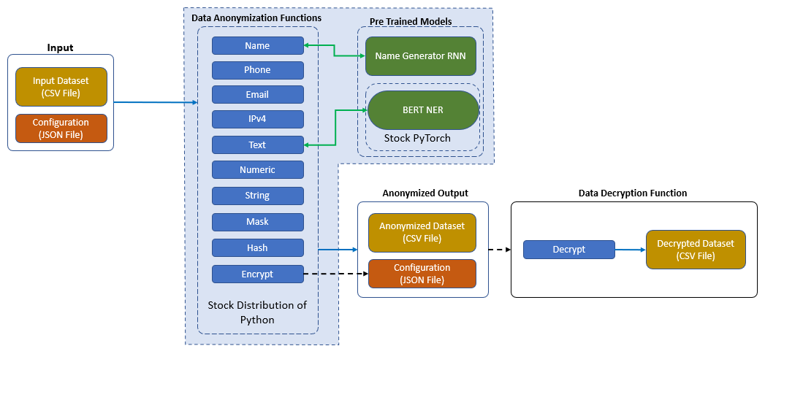
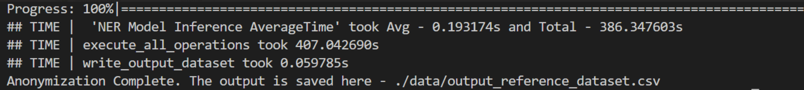
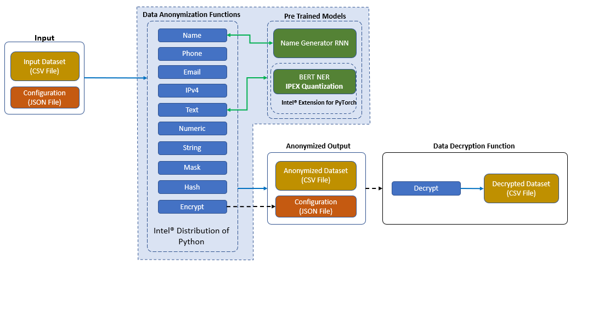
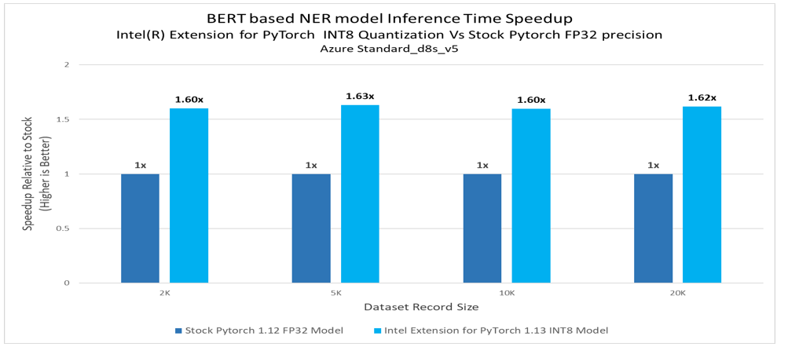

# Personal Identifiable Information (PII) Anonymization Reference Kit

## Introduction
Personal Identifiable Information (PII) is sensitive information that can be used to identify or locate an individual. Protecting PII data in the data science world, is important to maintain the privacy and security of individuals and essential for compliance with data privacy laws and regulations.

This repository provides PII anonymization utility functions, which include methods for masking, hashing and encrypting/decrypting the PII data in large datasets.

## Table of Contents 
 - [Purpose](#purpose)
 - [Reference Solution](#reference-solution)
 - [Reference Implementation](#reference-implementation)
 - [Intel® Optimized Implementation](#optimizing-the-end-to-end-solution-with-intel%C2%AE-oneapi-components)
 - [Performance Observations](#performance-observations)
 

## Purpose
PII anonymization is the process of obscuring or removing PII data from a dataset to protect the privacy and security of individuals. If not managed correctly, there is a possibility of sensitive information being used for harm or to compromise an individual’s privacy.

In general, PII anonymization is an important consideration when working with datasets that contain sensitive information. 
1. It is essential, considering most of the data privacy laws and regulations (e.g., GDPR for EU, HIPAA ,etc). 
2. Anonymization is necessary to protect an individual’s identity by preventing identity theft. Anonymization helps to reduce access to an individual’s identity and misuse of personal information by malicious actors
3. Since data is very essential to most processes, anonymization also helps organizations and groups to share and analyse data without exposing sensitive information.

There are several methods that can be used to anonymize PII data, including masking, hashing, and encryption/decryption. Each method has its own strengths and limitations, and the appropriate method to use, depends on the specific requirements and constraints of the dataset and the use case.

This repository aims to provide the user with access to quick anonymization techniques for text-based datasets stored in CSV file format.


## Reference Solution  
In this reference kit, we provide utility functions that use random generation functions for strings and numeric characters to mask PII data. It also comes with pre-defined operations for common data (such as name, IP addresses, phone numbers, etc.)

To anonymize data fields containing names, a random name generator RNN model is used in a pickled format, which generates realistic synthetic names.
A pre-trained BERT model is used for Named entity recognition (NER) in free-flowing text; the identified entities are then masked using available obfuscation methods. This reference implementation considers the below tags for masking the PII datasets.
- PER - Person Name
- LOC - Location Name
- ORG - Organization Name

## Key Implementation Details
- Highlighted the difference between using Intel® oneAPI packages specially Intel® Extension for PyTorch* v1.13.0 against the packages of the stock version of the PyTorch v1.12.0.
- This codebase is implemented in Python and uses NumPy and Pandas for data processing. The functions are applied to a Pandas DataFrame using the apply method, also optimized using the Numba library for faster execution (wherever applicable).
- Training script to build random name generation model which is based on Recurrent Neural Network which is being used as part of the PII data anonymization utility functions.
- Random dataset generator script to generate random PII data which can be used for benchmarking purpose of the PII data anonymization utility functions.

## Reference Implementation
### Use Case End-To-End flow


### Expected Input-Output
|               **Input**               |   **Output**   |
|:-------------------------------------:|-----|
| CSV file, containing PII data |  CSV file, with PII data anonymized  |
| JSON file, listing columns to anonymize | JSON file, to aid decryption process (optional, only in case of encryption) |


### Reference Sources
*Name Generation, Repo*: https://github.com/chaitanyarahalkar/Name-Generator-RNN 
*BERT based NER model, Repo*: https://huggingface.co/dslim/bert-base-NER

> ***Please see the model and dataset applicable license for terms and conditions. Intel® Corporation does not own the rights to the model and does not confer any rights to it.***

### Repository clone and Anaconda installation

###  For cloning the repository  please execute below 

```
git clone https://github.com/oneapi-src/ai-data-protection
cd ai-data-protection
```

> **Note**: If you are beginning to explore the reference kits on client machines such as a windows laptop, go to the [Running on Windows](#running-on-windows) section to ensure you are all set and come back here

> **Note**: The performance measurements were captured on Intel® Xeon® based processors. The instructions will work on WSL, however some portions of the ref kits may run slower on a client machine, so utilize the flags supported to modify the epochs/batch size to run the training or inference faster. Additionally, performance claims reported may not be seen on a windows based client machine.

> **Note**: This reference kit implementation already provides the necessary conda environment configurations to setup the software requirements. To utilize these environment scripts, first install Anaconda/Miniconda by following the instructions at the following link  
> [Anaconda installation](https://docs.anaconda.com/anaconda/install/linux/)

### Environment
Below is the developer environment used for this module on Azure. All the observations captured are based on these environment setups.

| **Size** | **CPU Cores** | **Memory** | **Intel® CPU Family** |
|----------|:-------------:|:----------:|:---------------------:|
|    *Standard_D8_V5*    |       8       |    32GB    |        ICELAKE        |


**YAML file**                                 | **Environment Name** |  **Configuration** |
| :---: | :---: | :---: |
| `env/stock/pii-stock.yml`             | `pii-stock` | Python v3.9 with stock PyTorch v1.12.0


## Usage and Instructions
Below are the steps to reproduce the benchmarking results given in this repository
1. Creating the execution environment
2. Dataset generation
3. Configuration file preparation
4. Preparing dependent models
5. Anonymization script execution
6. Decryption script execution (Optional)


### 1. Environment Creation

**Setting up the environment for Stock PyTorch**<br>Follow the below conda installation commands to set up the Stock PyTorch v1.12.0 environment for the model inferencing. 

```sh
conda env create -f env/stock/pii-stock.yml
```
*Activate stock conda environment*

Use the following command to activate the environment that was created:

```sh
conda activate pii-stock
```

### 2. Dataset Generation
Since the data to process considers sensitive information, synthetic data is generated to gauge the reference solutions performance. But to test PII anonymization for a large dataset, we need a large corpus of generated English sentences. Therefore, we combine synthetic data generated using random string literals and a publicly available data source - [People Wikipedia Data](https://www.kaggle.com/datasets/sameersmahajan/people-wikipedia-data)  from [Kaggle](https://www.kaggle.com) to increase the size of the corpus.

> ***Please see the model and dataset applicable license for terms and conditions. Intel® Corporation does not own the rights to the model and does not confer any rights to it.***

#### People Wikipedia Data
A dataset download command has been provided which downloads this dataset from Kaggle. A Kaggle account is required to download the file.
Details has been provided in `data/DATASET.md` 

#### Generate synthetic dataset
The `generate_reference_dataset.py` script combines the People Wikipedia Data and the random string literals to generate a complete dataset to test anonymization. The output is stored in the `data` folder 

**Command line Interface**
```bash
usage: generate_reference_dataset.py [-h] [-n NUMBER] -d DATA -o OUTPUT

optional arguments:
  -h, --help            show this help message and exit
  -n NUMBER, --number NUMBER
                        Provide the number of records to generate
  -d DATA, --data DATA  Provide the path to People Wiki Dataset
  -o OUTPUT, --output OUTPUT
                        Provide the path to save the reference dataset

```
**Example**

```bash
 python src/generate_reference_dataset.py -n 2000 -d data/people_wiki.csv -o data/input_reference_dataset.csv
```

This will generate a CSV file in the data folder which can then be utilized with the config JSON file provided in the folder - `config/reference_dataset_config.json`
 
 **Note**: This is  how synthetic data is generated to do the benchmarking shown in the later sections (n=number of records which can be changed accrording)

### 3. Configuration File Preparation
After generating a sample dataset in the previous section, a corresponding configuration file that can be used with the same is provided. The anonymization script reads the input dataset CSV and the configuration JSON files, then outputs an anonymized version of the CSV file. The columns within the CSV file that needs to be anonymized should specified individually in the JSON file.

The JSON file contains an array of objects, each object representing a column in the file. Each object mandatorily needs to have two properties: `column` and `type`.
`column` refers to the header provided for a particular column in the CSV file, while `type` signifies the type of anonymization operation that should be performed on the column.

A sample CSV file structure with PII data
| Full Name | Phone Number | Country
--| -- | -- 
John Doe | +1 234 45673 | USA
Jane Doe | (123) 4567 890 | UK

A sample JSON configuration file structure to instruct this reference utility to anonymize these data
```json
{
  "input_file": "./data/input_reference_dataset.csv",
  "output_file": "./data/output_reference_dataset.csv",
  "encryption_key_file": "./config/reference_dataset_keys.json",

  "operation":[
    {
      "column": "Full Name",
      "type": "name"
    },
    {
      "column": "Phone Number",
      "type": "encrypt"
    }  
  ]
}
```
Input | Description |
-- | -- | --
`input_file` | Mandatory. Path to the CSV file to be anonymized <br> For relative paths use `src` folder as the root|
`output_file` | Mandatory. Path to create the anonymized CSV file <br> For relative paths use `src` folder as the root|
`encryption_key_fie` | Optional. Path to store the encryption key JSON, when encryption task is performed on any column.|
`operation` | Mandatory. List of operations(as a dict) to be performed on each column <br> `column` - Mandatory. Column on which the operation should be performed <br> `type` - Mandatory. Type of operation to be performed <br>Specific details on each operation are provided below

<br>

This reference data anonymization utility script provides a list of anonymization techniques available, which is detailed below
Type | Description | Parameters
-- | -- | --
`numeric      ` | Generates random numbers  | `length` : Optional. Length of the generated number. Default the mean length of the column is used.
`string       ` |  Generates random strings | `length` : Optional. Length of the generated number. Default the mean length of the column is used.
`name         ` | Generates full names |  `length` : Optional. Length of the generated name. Default the mean length of the column is used.                 |
`phone        ` | Generates phone numbers |`length` : Optional. Length of the generated number. Default the mean length of the column is used.  <br> `prefix` - Default +91 is used.
`ip_address   ` | Generates random IPv4 address in the format `xxx.xxx.xxx.xxx` | 
`email_address` | Generates email addresses in the format `<generated_name>@domain.com` |
`alphanumeric ` | Generates random string using both alphabets and numbers | `length` : Optional. Length of the generated number. Default the mean length of the column is used.
`mask (maskdigit)       ` | Masks mentioned sequences within the text with a specified character | `start` : Optional. Default 0. Starting position to mask <br> `end` : Optional. Default *len(str)*. Ending position to mask. <br> `char` : Optional. Default *x*. Character used to mask sequences
`hash         ` | Creates a MD5 hash of the content |
`encrypt      ` | Symmetric encryption of the content using AES-128, replaces with a URL-safe base64-encoded text <br> A JSON file with the encryption keys are saved during execution. This is useful to decrypt the data later.  | `index _number`- Optional. Default indexing are *1* & *2* 
`text     `     |BERT based NER Model identifies entities such as `Person`, `Organization` and `Location` from wide range of text and masks them with randomly generated text |    

### 4. Preparing dependent models
To generate anonymized dataset in addition to masking and obfuscation tasks for the listed datatypes, the help of relevant and available models are taken to augment certain tasks.

#### Name Generator RNN Model
> Required for operations on
Type: **`name`**

An RNN model is used to generate realistic and contextual names to replace actual names within the dataset. The model is trained, and the weights are exported as a pickle file, which is then used by the anonymization script. 
More information can be found [here](https://github.com/chaitanyarahalkar/Name-Generator-RNN)

The steps to generate the pickle file is detailed below
```sh
sh src/build_name_generator_rnn.sh
```

After the model is trained, the pickle file will be then saved under `model/` folder

> Wait till the message `Script Execution COMPLETED` appears on the console

#### BERT based NER Model
> Required for operations on
Type: **`text`**

In addition, to the various structured text anonymization that are provided. The script also provides an option to mask PII data within unstructured free flowing text
The script, with the help of the [BERT Named Entity Recognition (NER) model](https://huggingface.co/dslim/bert-base-NER), which identifies entities such as `Person`, `Organization` and `Location` from a large text and masks them.

For e.g.,
Input
```text
Sunny Fong Born 1977 Is A Fashion Designer Who Owns Vawk A Clothing Brand He Lives In Toronto Ontario In 2009 He Won The Second Season Of Project Runway
```
Output
```text
XXXXX XXXX Born 1977 Is A Fashion Designer Who Owns Vawk A Clothing Brand He Lives In XXXXXXX XXXXXXX In 2009 He Won The Second Season Of Project Runway
```

Since the model in accessed using huggingface, we directly utilize their library <u>[`transformers`](https://huggingface.co/docs/transformers/installation)</u> to instantiate and perform inference on the model. The transformer under the hood runs on PyTorch, which is included as a dependency already in the environment configuration.


### 5. Anonymization script execution
Once the above steps are complete, we can directly invoke the script, which would perform the following tasks
1. Load Dataset and Config file
2. Iterate through each operation listed in the Config file and execute them
3. Save the new anonymized dataset in the location provided in the Config file

**Command Line Interface**
```sh
usage: anonymize_data.py [-h] [-c CONFIG] [-b BERT_NER_MODEL] [-i] [-m] [-l LOGFILE] [-v]

optional arguments:
  -h, --help            show this help message and exit
  -c CONFIG, --config CONFIG
                        Provide the configuration JSON file. Default - `./config/reference_dataset_config.json`
  -b BERT_NER_MODEL, --bert_ner_model BERT_NER_MODEL
                        Provide the BERT based NER model file, from hugging-face repository or saved model file. Default - `dslim/bert-base-NER`
  -i, --ipex            Use IPEX optimized inference.
  -m, --modin           Use Modin instead of Pandas. Useful while dealing with large datasets.
  -l LOGFILE, --logfile LOGFILE
                        log file to output benchmarking results to
  -v, --verbose         Show progress bars during execution.

```


**Example**
```sh
python src/anonymize_data.py --bert_ner_model dslim/bert-base-NER --config ./config/reference_dataset_config.json --verbose  
```
**Note:** To save output to a logfile, please add an argument `--logfile stock_log` to `src/anonymize_data.py`, the log will be saved in the ./log folder 

**Expected Output**
The output anonymized CSV data file will be generated at location specified in the configuration value of the JSON key `output_file`

In case of any encryption task performed, a JSON file containing the encrypted key will be saved in the location specified in the configuration value of the JSON key `encryption_key_file`



### 6. Decryption script execution
> Only in situations where encryption was performed for any columns in the input data file, and the generated `keys.json` is available

If an encryption task was performed during the anonymization scrip execution, it will create a key file in `config\keys.json`
This file contains basic details such as:
- `encrypted_CSV` - String. Location where the ecnrypted file was saved
- `keys` - Array of Dict. Contains the `column` name which was encrypted and the corresponding `key` used for encryption.

A sample `keys.json`:
```json
{
    "keys": [
        {
            "column": "Phone Number",
            "key": "TwkYClFk6s5bzdi5vEyojFI3_ZIOkplgcfo9Loaz5FY="
        }
    ],
    "encrypted_CSV": "./data/output_dataset.csv"
}
```

Since the encryption is symmetrical in nature, the same key is used to decrypt the data too.

**Command Line Interface**
```sh
usage: decrypt_data.py [-h] [-c CONFIG] [-o OUTPUT]

optional arguments:
  -h, --help            show this help message and exit
  -c CONFIG, --config CONFIG
                        Provide the encryption keys JSON file. Default - `./config.json`
  -o OUTPUT, --output OUTPUT
                        Provide path where the decrypted file should be saved
```

**Example**
```sh
python src/decrypt_data.py --config './config/keys.json' --output './data/decrypted_reference_dataset.csv'
```

**Expected Output**
The output CSV data file with the decrypted columns will be generated at location specified argumend `--output`


## Optimizing the E2E solution with Intel® oneAPI components

### **Use Case E2E flow**


### **Optimized software components**
**YAML file**                                 | **Environment Name** |  **Configuration** |
| :---: | :---: | :---: |
| `env/intel/pii-intel.yml`             | `pii-intel` | Python v3.9 with Intel® Extension for PyTorch v1.13.0

### Usage and Instructions
Below are the steps to reproduce the benchmarking results given in this repository
1. Creating the execution environment
2. Anonymization script execution
3. BERT based NER model quantization

### 1.  Environment Creation

**Setting up the environment for Intel Extension for PyTorch**<br>Follow the below conda installation commands to set up the Intel® Extension for PyTorch v1.13.0 environment. 

```sh
conda env create -f env/intel/pii-intel.yml
```
*Activate intel conda environment*

Use the following command to activate the environment that was created:

```sh
conda activate pii-intel
```

### 2.  Anonymization script execution
```sh
usage: anonymize_data.py [-h] [-c CONFIG] [-b BERT_NER_MODEL] [-i] [-m] [-l LOGFILE] [-v]

optional arguments:
  -h, --help            show this help message and exit
  -c CONFIG, --config CONFIG
                        Provide the configuration JSON file. Default - `./config/reference_dataset_config.json`
  -b BERT_NER_MODEL, --bert_ner_model BERT_NER_MODEL
                        Provide the BERT based NER model file, from hugging-face repository or saved model file. Default - `dslim/bert-base-NER`
  -i, --ipex            Use IPEX optimized inference.
  -m, --modin           Use Modin instead of Pandas. Useful while dealing with large datasets.
  -l LOGFILE, --logfile LOGFILE
                        log file to output benchmarking results to
  -v, --verbose         Show progress bars during execution.

```

**Command to start execution with IPEX Optimized NER model**
```sh
  python src/anonymize_data.py  --bert_ner_model  dslim/bert-base-NER  --config ./config/reference_dataset_config.json --ipex --verbose 
```
**Note:** To save output to a logfile, please add an argument `--logfile  intel_log` to `src/anonymize_data.py`, the log will be saved in the ./log folder 

**Expected Output**
The output anonymized CSV data file will be generated as per the configuration JSON key `output_file`

### 3.  Performance optimization with BERT based NER model quantization
Model quantization is one way to optimize the inference process of a trained model by converting weights and operations from FP32 precision to the much smaller INT8 precision.

For the pre-trained BERT based NER model used in the anonymization script above, we demonstrate a way to quantize this trained model from FP32 to INT8 format, using the ***Intel® Extension for PyTorch*** to quickly produce a quantized model without additional packages (Dynamic Quantization)

**Dynamic Quantization using *Intel® Extension for PyTorch***

The ***Intel® Extension for PyTorch*** can be used to perform both dynamic and static quantization.  Here, we provide the `quantize_bert_ner_ipex.py` script to do dynamic quantization of the BERT based NER pre-trained model and save a new version that can be used within the data anonymization script.

```
usage: quantize_bert_ner_ipex.py [-h] --model MODEL --save_model_dir SAVE_MODEL_DIR

optional arguments:
  -h, --help            show this help message and exit
  --model MODEL         Pretrained BERT based NER model to use
  --save_model_dir SAVE_MODEL_DIR
                        directory to save the quantized model to
```

A command to quantize the BERT based NER pre-trained model is

```sh
python src/quantize_bert_ner_ipex.py --model dslim/bert-base-NER --save_model_dir ./saved_models/bert-base-ner-pre-trained-ipex/
```
**Expected Output**<br>

The Ipex Quantized  model will be saved in .pt checkpoint format in 'saved_models/bert-base-ner-pre-trained-ipex' folder in the current directory , once quantization completed as shown in below .

```
saved_models/
|
└------- bert-base-ner-pre-trained-ipex
        ├── vocab.txt
        ├── tokenizer_config.json
        ├── tokenizer.json
        ├── special_tokens_map.json
        ├── saved_model_bert_base_ner.pt
     
  
```      
Once the quantized model is created, we can use the data anonymization script to use the same for PII Data anonymization as below:

> Note that the BERT based NER model is used only for detagging PII data for the dataset column which is of free flow text type and the anonymization configuration should be requested for the `text` type as mentioned in this [section](#bert-based-ner-model)

**Example**
```sh
python src/anonymize_data.py --bert_ner_model ./saved_models/bert-base-ner-pre-trained-ipex/saved_model_bert_base_ner.pt --config ./config/reference_dataset_config.json --verbose --ipex 
```
**Note:** To save output to a logfile, please add an argument `--logfile  intel_quantized_NER_log` to `src/anonymize_data.py`, the log will be saved in the ./log folder 

### 4.  Performance optimization with Intel® Distribution of Modin*

#### 4.1 Environment Creation

**Setting up the environment for Intel® Distribution of Modin**<br>Follow the below conda installation commands to set up the Intel® Distribution of Modin environment. 

```sh
conda env create -f env/modin/pii-modin.yml
```
*Activate modin conda environment*

Use the following command to activate the environment that was created:

```sh
conda activate pii-modin
```

#### 4.2  Anonymization script execution

Use the folowing command to run the PII data anonymization tool with modin

```sh
 python src/anonymize_data.py --bert_ner_model dslim/bert-base-NER --config ./config/reference_dataset_config.json --modin 
```
**Note:** To save output to a logfile, please add an argument `--logfile modin_log` to `src/anonymize_data.py`, the log will be saved in the ./log folder 

## Performance Observations
 Any information that can be used to distinguish one person from another and can be used to deanonymize previously anonymous data is considered PII. In case of a data breach, data will leak, and publicly it can be accessible Therefore it’s vital to protect the sensitive data. As PII data protection becomes a growing focus of Industries data protection, it will become increasingly important to optimize wherever possible. Intel® strives to bring those optimizations in all types of data anonymization pipeline.
 
### Observations
Intel® Modin brings performance speedup for applying a function across a whole dataframe also reading large CSV files which is significant when scaling out these solutions. Sometimes optimizations are less consistent as we see a drop in performance while executing some operations like  string  anonymization  to protect the sensitive data. Intel® Modin continues to be in development so you may expect further optimizations to these libraries.

#### Performance Benchmarking results


<br>**Key Takeaways**<br>
- In this PII data protection experiment, the performance of read_csv() API speedup upto 2.35x gain has been observed with Intel® Distribution of Modin for 4M dataset

#### BERT based NER model Inference benchmarking results


<br>**Key Takeaways**<br>
 - BERT based NER model inference time speedup with Intel® Extension for PyTorch v1.13.0 INT8 Model shows up to 1.63x  against Stock PyTorch v1.12.0 FP32 Model.


### Notices & Disclaimers
Performance varies by use, configuration, and other factors. Learn more on the [Performance Index site](https://edc.intel.com/content/www/us/en/products/performance/benchmarks/overview/). 
Performance results are based on testing as of dates shown in configurations and may not reflect all publicly available updates. See backup for configuration details.  No product or component can be absolutely secure. 
Costs and results may vary. 
Intel technologies may require enabled hardware, software or service activation. <br>
© Intel Corporation. Intel, the Intel logo, and other Intel marks are trademarks of Intel Corporation or its subsidiaries.  Other names and brands may be claimed as the property of others.  

**Date Testing Performed**: March 2023

**Configuration Details and Workload Setup**: Azure D8v5 (Intel® Xeon® Platinum 8370C CPU @ 2.80GHz), 1 Socket, 4 Cores per Socket, 2 Threads per Core, Turbo: On, Total Memory: 32 GB, OS: Ubuntu 20.04, Kernel: Linux 5.15.0-1019-azure. Framework/Toolkit: PyTorch v1.12.0, Intel® Extension for PyTorch v1.13.0.

**Testing performed by** Intel Corporation

### Appendix

### **Running on Windows**

The reference kits commands are Linux based, in order to run this on Windows, go to Start and open WSL and follow the same steps as running on a Linux machine starting from git clone instructions. If WSL is not installed you can [install WSL](https://learn.microsoft.com/en-us/windows/wsl/install).

> **Note** If WSL is installed and not opening, go to Start ---> Turn Windows feature on or off and make sure Windows Subsystem for Linux is checked. Restart the system after enabling it for the changes to reflect.

### **Experiment setup**

| Platform                          | Microsoft Azure: Standard_D8_v5 (Ice Lake)<br>Ubuntu 20.04
| :---                              | :---
| Hardware                          | Azure Standard_D8_V5
| Software                          | Intel® oneAPI AI Analytics Toolkit, Intel® Extension for PyTorch v1.13.0
| What you will learn               | Advantage of using Intel® Extension for PyTorch v1.13.0 over the stock PyTorch v1.12.0.

### Known Issues
These experiments are provided to highlight the optimizations seen from Intel® oneAPI technologies in specific operation and how they scale. Please bear in mind that the exact gains you see here may or may not match the results of using these technologies in larger-scale real world operations.
1. Common prerequisites required to run python scripts in Linux system.
    Install gcc and curl.  For Ubuntu, this will be: 

      ```bash
      apt install gcc
      sudo apt install libglib2.0-0
      sudo apt install curl
      ```

2. ImportError: libGL.so.1: cannot open shared object file: No such file or directory
   
    **Issue:**
      ```bash
      ImportError: libGL.so.1: cannot open shared object file: No such file or directory
      or
      libgthread-2.0.so.0: cannot open shared object file: No such file or directory
      ```

    **Solution:**

      Install the libgl11-mesa-glx and libglib2.0-0 libraries. For Ubuntu this will be:

     ```bash 
     sudo apt install libgl1-mesa-glx
     sudo apt install libglib2.0-0
      ```
3. Out of memory errors

    This experiment has been performed on Azure Standard_D8_V5 ,a system memory of 32 GB. In this experiment some senerios out of memory  meassege were displayed for 6M dataset ( Modin Wrire csv operation ,also  text anonymization in Stock envoroment with 6M data) 
 
     <br>**Issue:**
    ```bash 
     ray.exceptions.OutOfDiskError: Local disk is full
     The object cannot be created because the local object store is full and the local disk's utilization is over capacity (95% by default)
      
    ```
     **Solution:**
    ```bash 
     This can be avoided with High performance (HBv2, HBv3, HC)  Azure VMs with high CPU and memory along with high-throughput network interfaces (RDMA) .
      
    ```
